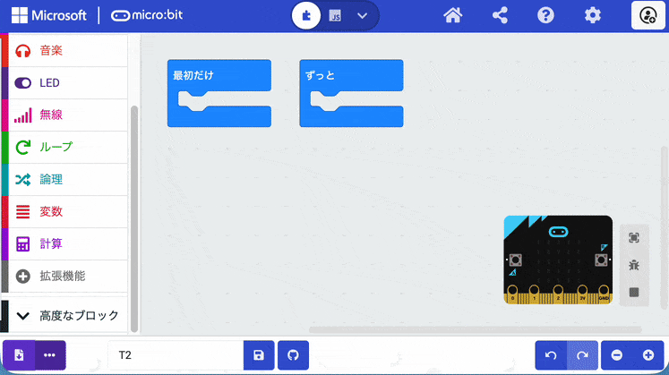
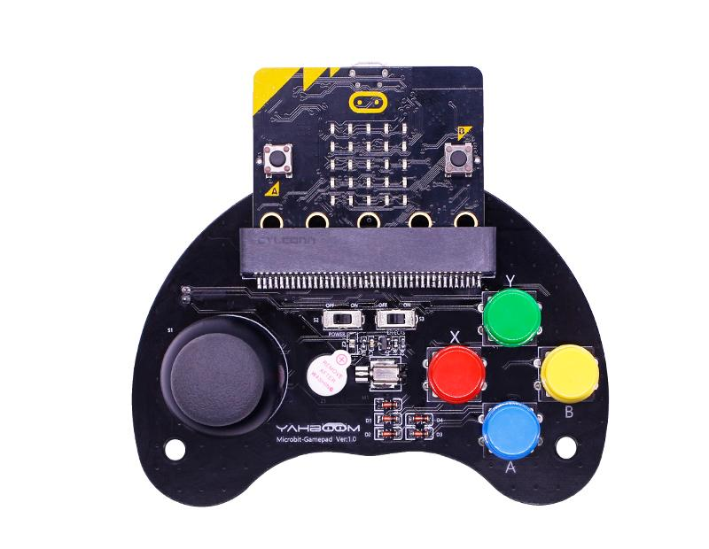

# MakeCode for micro:bit 拡張機能 (YB-EMH02)

ゲームパッド(YB-EMH02) 向けの拡張機能です。
[公式(Yahboon)](https://github.com/YahboomTechnology/Game-Handle-compact-version) からのリリースもありますが、こちらは、日本語対応と、ゲームパット機能のみに絞った初心者向けバージョンです。


## 拡張の追加

**拡張機能** から次の GitHub リポジトリ URL を追加してください。
`https://github.com/GreenNode-jp/pxt-yb-emh02`

<details open>
<summary><strong>動作イメージ</strong></summary>



</details>


##　APIレファレンス
下記のファイルにまとめています。
MakeCode上から、ブロックを右クリック→ヘルプ　でも同じものが参照できます。

- [isButtonPressed](docs/is-button-pressed.md)
- [joystickDirection](docs/joystick-direction.md)
- [joystickValue](docs/joystick-value.md)
- [unpackJoystickValue](docs/unpack-joystick-value.md)
- [onButtonEvent](docs/on-button-event.md)
- [setVibration](docs/set-vibration.md)


# ハードウエア

※ 私の手持ち YB-EMH02 Ver.1.3 に基づく




## IO ポート対応表

| IO port | Description |
| :--- | :--- |
| P0 | 振動モータ・圧電スピーカー | 
| P1 | ジョイスティック Y | 
| P2 | ジョイスティック X | 
| P8 | ジョイスティック ボタン | | |
| P13 | ボタン B1 (赤) |
| P14 | ボタン B2 (緑) |
| P15 | ボタン B3 (青) |
| P16 | ボタン B4 (黄) |
| - | 電源スイッチ (S2) <br/>左: OFF <br/>右: ON (電池から給電)  |
| - | 振動モータ・圧電スピーカ制御スイッチ　（S3)<br/>左: ソフト制御(P0で制御)<br/>右: 自動連動(ボタン押下で自動的に振動) |


## ビルド（開発者向け）

```bash
npx makecode build
```

成果物は `built/` に出力されます。

`makecode build` で作った `binary.hex` が MakeCode に取り込めない場合は、PXT CLI でビルドするとソース埋め込み付きの HEX になります。

```bash
npx pxt target microbit
npx pxt build
```

安定版エディタ: [makecode.microbit.org](https://makecode.microbit.org)  
ベータ版ビルドを使う場合は [beta エディタ](https://makecode.microbit.org/beta) で開いてください。
